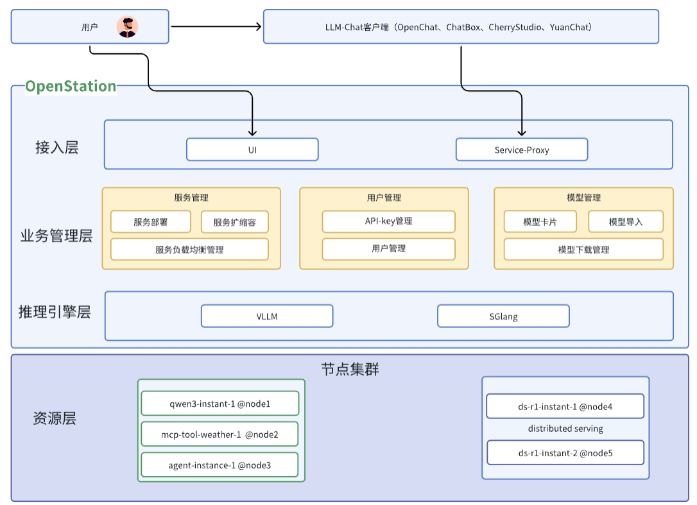
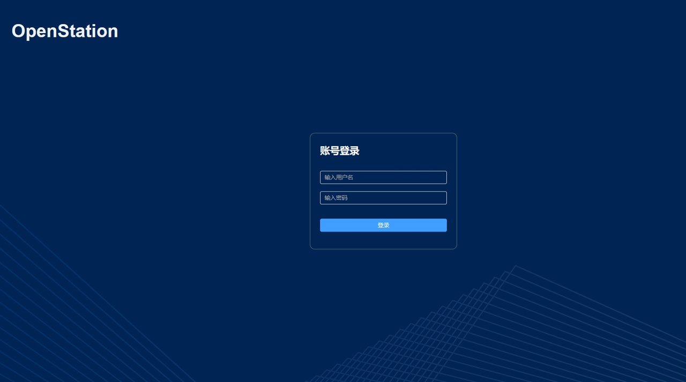

# **OpenStation：一站式大模型部署与管理平台**

## :tada: 最近更新

* :fire: \[2025-07-04] **OpenStation V0.6.5发布**

***

## 项目简介

**OpenStation** 是一款专为企业和开发者设计的一站式大模型部署管理平台，帮助用户快速、便捷地部署和体验大模型服务能力。

平台提供完整的模型管理、服务部署与用户协作功能，兼容标准 OpenAI API 接口，内置高效推理引擎，并提供灵活的资源扩缩容和精细的权限管理机制。

核心亮点：

* **简单易用**：无需编程，页面化操作快速完成 DeepSeek 等主流大模型的部署与服务上线。

* **标准接口**：服务兼容 OpenAI 标准接口，快速接入 OpenChat、YuanChat 等主流客户端工具。

* **灵活部署**：全面支持 GPU 和纯 CPU 环境，提供 vLLM、SGLang 等高性能推理引擎，支持单机及分布式推理。

* **资源管理**：支持计算节点快速添加、扩容及灵活管理，满足业务场景的弹性需求。

* **自动负载均衡**：内置负载均衡机制，统一服务访问入口，确保模型服务稳定高效。

* **协作与安全**：内置用户权限控制与 API-Key 管理体系，保障团队协作效率与服务安全。

OpenStation，让大模型部署从未如此简单！

**OpenStation的架构如下：**




## 开始

以下步骤将指导您快速完成 **OpenStation** 的部署与使用。详细操作说明请参考[ **用户手册**](./docs/OpenStation用户手册.md)。

### 1. 部署

#### 1.1 依赖条件

在安装 **OpenStation** 之前，请确保您的 **服务器操作系统** 符合以下版本要求：

| **操作系统**   | **在线部署**              | **离线部署**                    |
| ---------- | --------------------- | --------------------------- |
| **Ubuntu** | 22.04 / 20.04 / 18.04 | 22.04.2 / 20.04.6 / 18.04.6 |
| **CentOS** | CentOS 7              | 暂不支持                        |

> **注意**：
>
> * **OpenStation 目前仅支持 X86 架构服务器**，ARM 架构的适配正在开发中。
>
> * **在线部署** 需确保服务器具备 **稳定的网络连接** 以下载必要的依赖。
>
> * **离线部署** 需提前下载完整的 **安装包及依赖文件** 并手动安装。

#### 1.2 部署

##### 1.2.1 在线一键安装

如果您的服务器已连接互联网，可直接执行以下命令安装 **OpenStation**：

```shell
curl -O  https://fastaistack.oss-cn-beijing.aliyuncs.com/openstation/openstation-install-online.sh
#其中，--version 0.6.5表示本次安装OpenStation平台的版本
bash openstation-install-online.sh  --version 0.6.5
```
您也可以通过链接直接下载[在线安装包openstation-pkg-online-v0.6.5.tar.gz](https://fastaistack.oss-cn-beijing.aliyuncs.com/openstation/openstation-pkg-online-v0.6.5.tar.gz)，上传到服务器上执行以下安装命令：
```shell
tar -xvzf openstation-pkg-online-v0.6.5.tar.gz
cd openstation-pkg-online-v0.6.5/deploy
bash install.sh true
```

执行后，根据屏幕提示按 **回车键** 继续安装。安装程序将自动下载所需组件，具体 **安装时间取决于网络状况**。

安装过程中，您需输入 **本机节点 IP 地址** 及 **是否为 GPU 节点** 等信息，安装程序将根据配置自动完成 **OpenStation** 的部署。

##### 1.2.2 离线安装

###### 1.2.2.1下载安装包

我们提供 **预制的 OpenStation 离线安装包**，支持 **一键部署**。

| **包类型**       | **包下载地址**                                                                                       | **内容**        | **大小** |
| ------------- | ----------------------------------------------------------------------------------------------- | ------------- | ------ |
| **离线安装包**     | [点击下载](https://fastaistack.oss-cn-beijing.aliyuncs.com/openstation/openstation-pkg-v0.6.5.tar.gz) | 平台功能组件+推理引擎镜像 | 10.1GB |
| **安装包SHA256** | [点击下载](https://fastaistack.oss-cn-beijing.aliyuncs.com/openstation/SHA256SUM-0.6.5)                     | 安装包SHA256校验文件 | 96B    |

您可以使用 **浏览器下载**，或通过 **命令行下载**：

```shell
curl -O  https://fastaistack.oss-cn-beijing.aliyuncs.com/openstation/openstation-pkg-v0.6.5.tar.gz
curl -O  https://fastaistack.oss-cn-beijing.aliyuncs.com/openstation/SHA256SUM-0.6.5
```

下载完成后，请 **上传安装包至待部署节点**，并进行 **完整性校验。**

###### 1.2.2.2 安装

完成 **离线安装包上传** 后，在 **部署节点的安装包目录** 下执行以下命令：

```shell
#校验包的完整性
sha256sum -c SHA256SUM-0.6.5
#解压安装包，执行安装过程
tar -xvzf openstation-pkg-v0.6.5.tar.gz && cd openstation-pkg-v0.6.5/deploy && bash install.sh
```

> **安装过程说明**：
>
> * **系统将提示您输入**：&#x20;
>
>   * **本机节点 IP 地址**
>
>   * **是否为 GPU 节点**
>
> * **安装程序** 将自动完成 **环境配置** 和 **服务部署**。

#### 1.3 验证

安装完成后，使用 **浏览器访问** 部署节点的 **Web 界面**，以确认服务是否成功运行：

🔗 **访问链接**：`http://YOUR_NODE_IP:32206`

如果部署正确，您将看到 OpenStation 的 **登录页面** 或 **管理界面**。



登录用户名为admin，密码您可以参考[ **\[用户手册\]**](./docs/OpenStation用户手册.md) 的1.4章节。


**在使用过程中，您可参考以下文档获取更多帮助：**

* 📘[ **\[用户手册\]**](./docs/OpenStation用户手册.md) - 详细介绍 OpenStation 的安装、配置和使用方法。

* ❓  [**\[常见问题手册\]** ](./docs/OpenStation常见问题手册.md)- 收录常见问题及解决方案，帮助快速排查问题。

* 🔗[ **\[LLM 客户端接入 OpenStation 手册\]**](./docs/OpenStation对接CherryStudio、Chatbox配置指南.md) - 指导如何将ChatBox、CherryStudio等 LLM 客户端接入 OpenStation。

***
## 用户交流

欢迎扫码加入项目讨论群，反馈您的使用体验和想法


## 许可

本项目基于 **Apache License 2.0** 进行分发和使用。

📄 **获取更多信息**，请参考 [LICENSE](./LICENSE)。

