本手册主要介绍如何集成 OpenStation 与 Open-WebUI 平台，以实现用户账号与模型服务的统一管理。内容涵盖系统配置、服务监控、模型管理和权限控制等方面。

***

## 一、系统集成配置

进行系统集成，请按照以下步骤操作：

1. 在 OpenStation 中输入 Open-WebUI 的访问地址（IP 地址和端口号）。

2. 绑定 Open-WebUI 管理员账号。

3. 打开用户同步功能。

完成配置后，系统将自动验证服务连接及权限有效性。

> 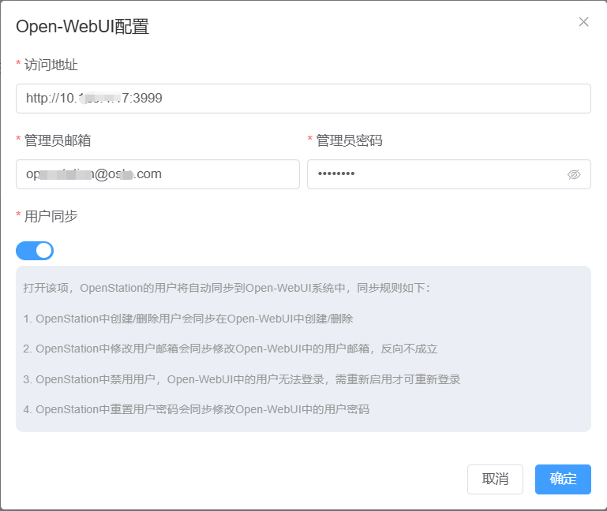

启用同步功能后，OpenStation 平台具备以下特性：

* 用户信息可通过 Excel 文件批量导入，OpenStation 自动在 Open-WebUI 创建相应账号并生成随机密码，通过邮件发送；

* OpenStation 中删除或修改用户信息时，Open-WebUI 会自动同步更新，无需人工干预。

***

## 二、服务连接与监控

系统集成成功后，Open-WebUI 的连接状态将在 OpenStation-WebUI 控制台显示，管理员可查看服务配置状态与用户同步情况。

> 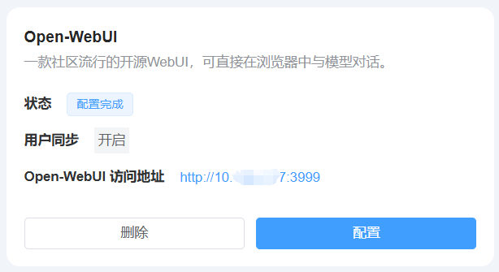

首次配置完成后，需要在 Open-WebUI 中设置外部连接，步骤如下：

1. 登录 Open-WebUI，进入“设置 - 外部连接”，选择添加新连接；

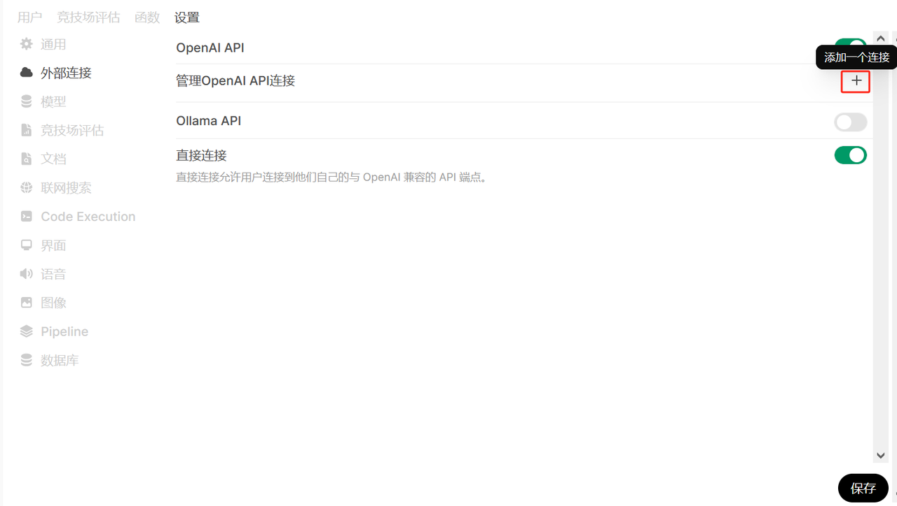

* 填入 OpenStation 提供的服务 URL 地址（需以 `/v1` 结尾）；

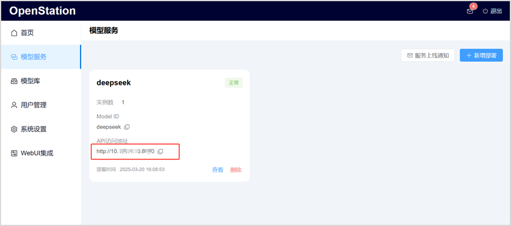

* 输入 OpenStation admin 用户的 API-KEY。

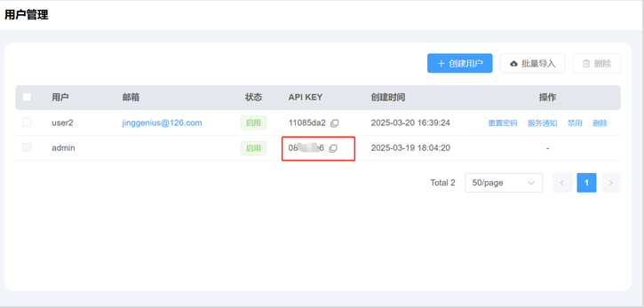

在Open-WebUI中添加一个外部连接，如图所示：

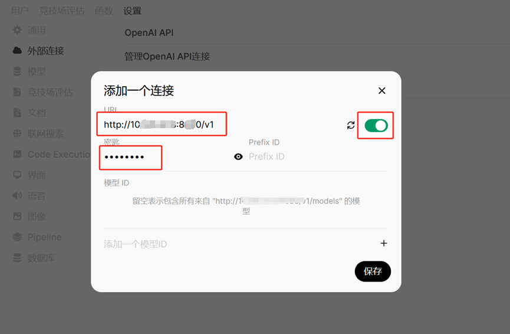

配置完成后点击保存按钮，会显示已经配置的信息：

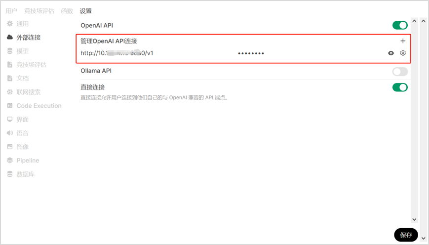

***

## 三、模型服务配置

Open-WebUI 中可直接调用 OpenStation 提供的模型服务。**管理员**需进行如下配置：

1. 在 Open-WebUI 管理界面中进入“设置 - 模型”选项；

2. 选择目标模型，并设定为“public”状态，以开放给所有用户使用。

> 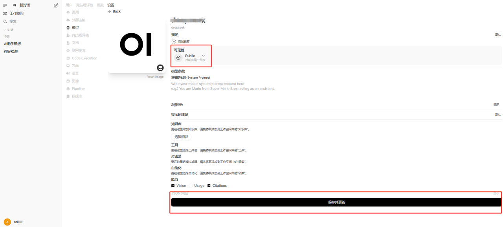

**普通用户&#x20;**&#x767B;录后即可访问并使用开放的模型服务。

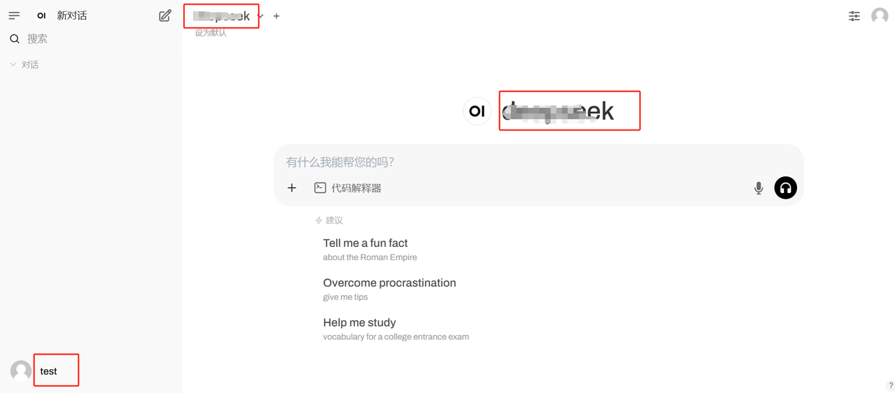

> **普通用户&#x20;**&#x4E5F;可以通过创建一个外部连接的方式，来接入OpenStation已部署的模型服务，此时 普通用户 需要填入自己专有的API Key。

***

## 四、权限控制管理

OpenStation 提供集中式权限控制功能，并与 Open-WebUI 同步，具体表现为：

* 在 OpenStation 中禁用账号后，Open-WebUI 中的账号将自动失效；

* 在 OpenStation 中重置用户密码，Open-WebUI 中会自动更新用户密码。

示例：OpenStation 管理员禁用 test 用户后，该用户将无法在 Open-WebUI 登录，系统提示如下：

> 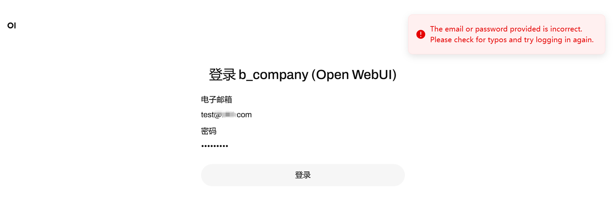

删除 test 账号后，该用户将在 Open-WebUI 同步删除。

> 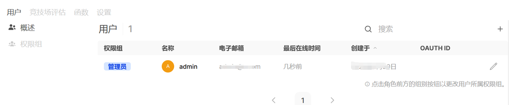

***

## 附录

如需更多帮助，请查看 [完整用户文档](../README.md)。
