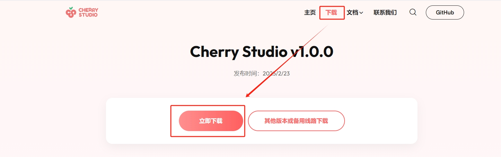
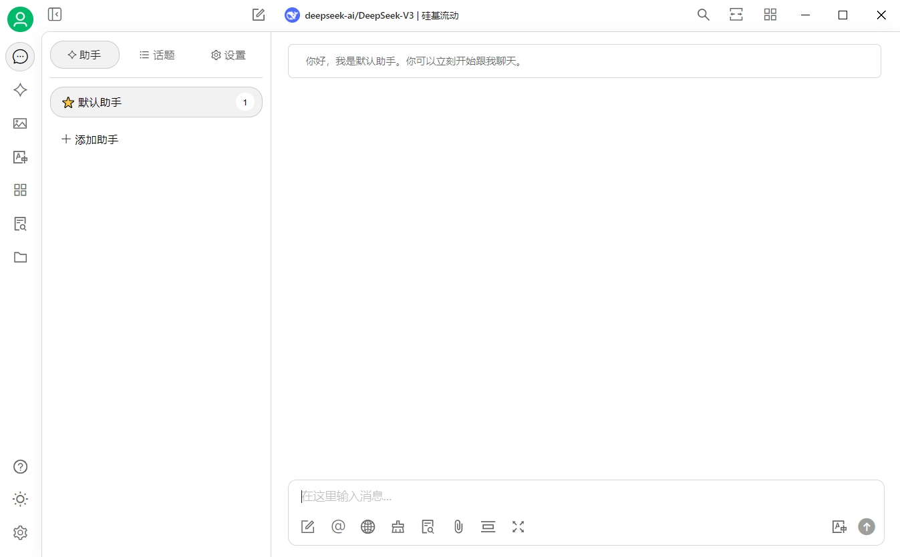
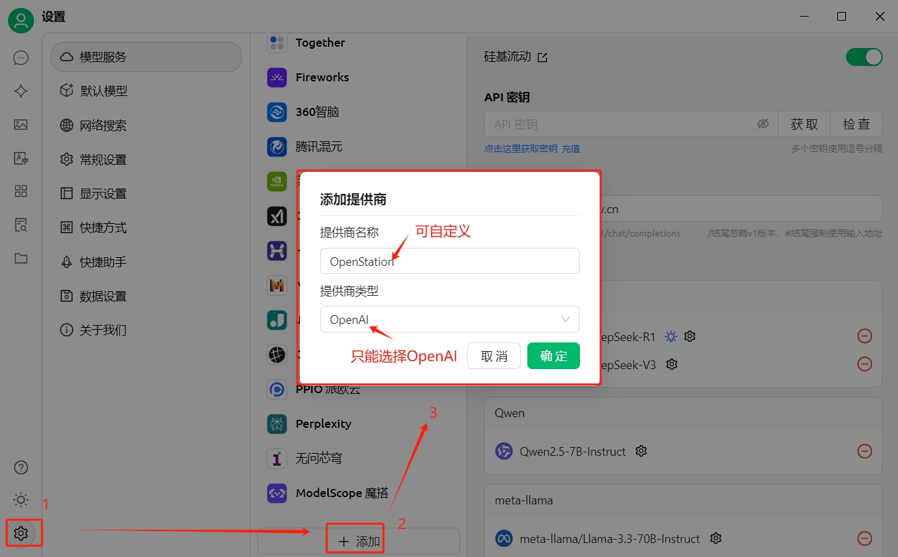
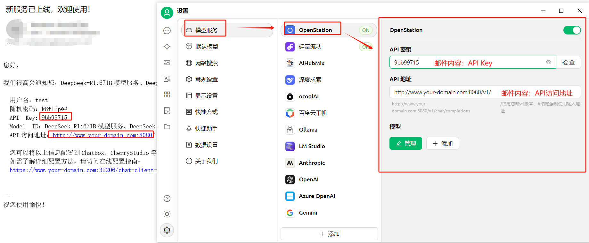
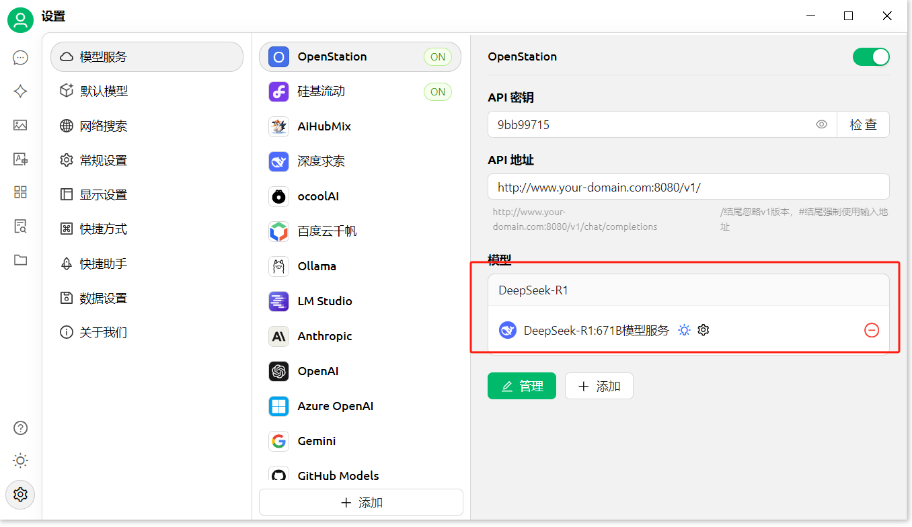
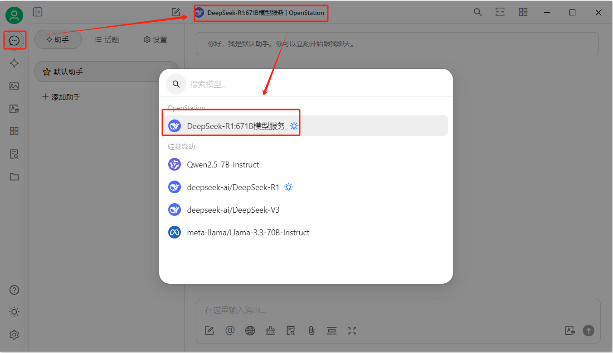
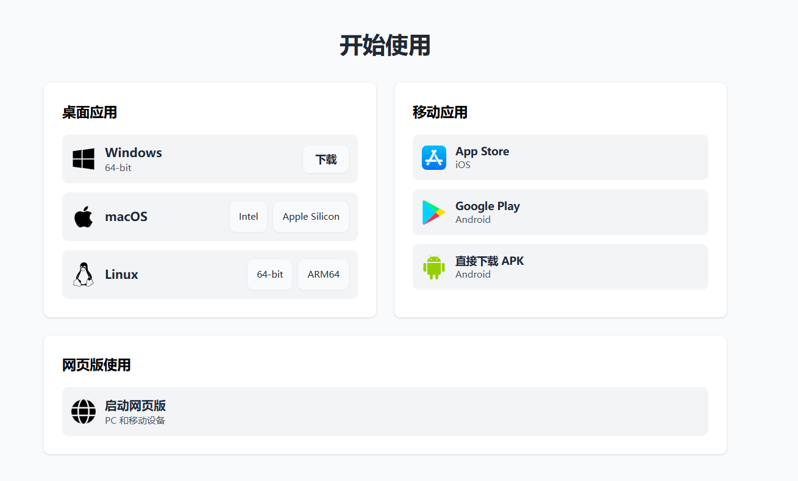
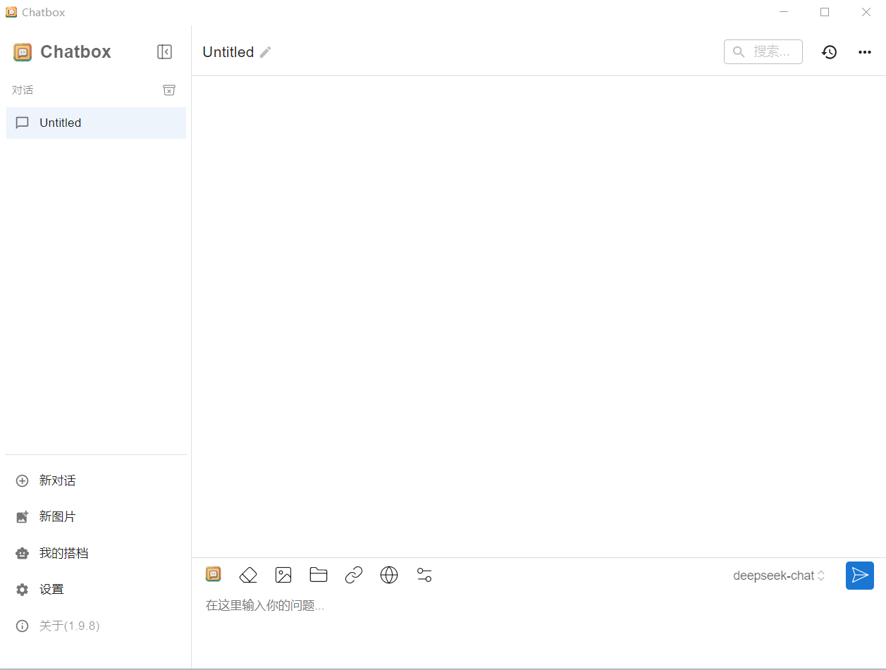
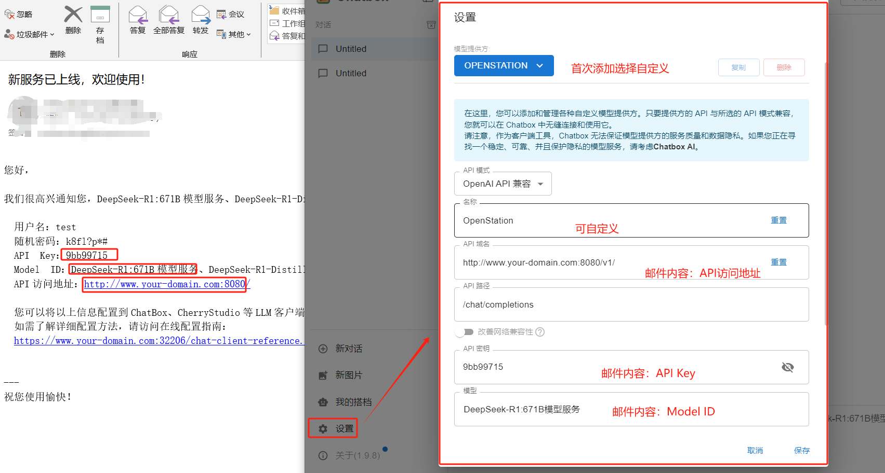
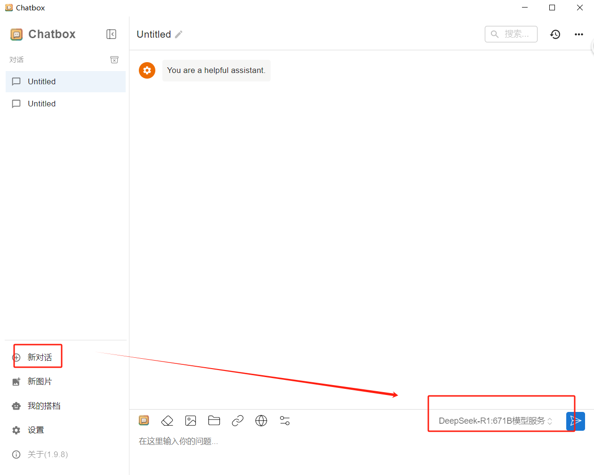

> 本文档主要介绍了如何使用cherryStudio及ChatBox对接OpenStation已部署的推理服务，其他LLM客户端工具对接的流程类似，可以参考。
# CherryStudio 接入 OpenStation 使用说明

## 下载与安装
打开官网地址：[https://www.cherry-ai.com/](https://www.cherry-ai.com/) ，点击下载，可以根据自己的系统选择对应的版本。

默认安装，安装完成界面如下：

## 配置模型

### 添加提供商
点击左侧 **设置 - 添加**，打开添加提供商界面，输入提供商名称，点击 **确定** 按钮。

**注意**：提供商类型只能选择 OpenAI。

### 添加 API密钥和 API地址
在 **设置 - 模型服务** 中选择添加的提供商（如 **OpenStation**），输入 API密钥和 API地址。

### 添加模型
在 **设置 - 模型服务** 中选择添加的提供商（如 **OpenStation**），在 **模型** 区域点击 **添加** 按钮，完成模型添加操作。

## 信息获取说明
在个人邮箱中搜索主题为“新服务已上线，欢迎使用！”的最新邮件，可从中获取以下信息：
- API Key
- API访问地址
- Model ID

**注意**：可以重复上述步骤完成多个模型的添加。

## 开启对话
在 **助手** 中选择对应模型开启对话。

# ChatBox 接入 OpenStation 使用说明

## 下载与安装
打开官网下载地址：[https://chatboxai.app/zh#download](https://chatboxai.app/zh#download) ，可以根据自己的系统选择对应的版本。

默认安装，安装完成界面如下：

## 配置模型
点击 **设置**，打开设置页面，完成模型添加操作。

### 配置信息说明
- **模型提供方**：首次选择“添加自定义提供方”，再次添加模型时可以选择上次保存的名称。
- **API模式**：只能选择“OpenAI API 兼容”。
- **名称**：可自定义。
- **API域名**：来源于邮件正文中的“API 访问地址”。
- **API密钥**：来源于邮件正文中的“API Key”。
- **模型**：来源于邮件正文中的“Model ID”。

## 信息获取说明
在个人邮箱中搜索主题为“新服务已上线，欢迎使用！”的最新邮件，可从中获取以下信息：
- API Key
- API访问地址
- Model ID

**注意**：可以重复上述步骤完成多个模型的添加。

## 开启对话
点击左侧 **新对话**，并且选择配置的模型，发起对话。

