# 1. 安装部署

本章节将指导用户完成 **OpenStation** 平台的安装部署，包括环境要求、安装步骤和注意事项。

## 1.1 软件获取

在安装 **OpenStation** 之前，需要下载 **安装部署脚本** 或 **安装包**，具体获取方式如下：

* 在线安装

对于 **在线安装**，需要先下载 **安装部署脚本**，然后执行安装命令。Linux 下的获取方式如下：

```bash
curl -O  https://fastaistack.oss-cn-beijing.aliyuncs.com/openstation/openstation-install-online.sh
```
您也可以通过链接直接下载[在线安装包openstation-pkg-online-v0.6.8.tar.gz](https://fastaistack.oss-cn-beijing.aliyuncs.com/openstation/openstation-pkg-online-v0.6.8.tar.gz)

* 离线安装

对于 **离线安装**，需要先下载 **安装包** 和 **SHA256SUM 文件**（用于校验文件完整性）。Linux 下的获取方式如下：

```bash
curl -O  https://fastaistack.oss-cn-beijing.aliyuncs.com/openstation/SHA256SUM-0.6.8
curl -O  https://fastaistack.oss-cn-beijing.aliyuncs.com/openstation/openstation-pkg-v0.6.8.tar.gz
```

## 1.2 操作系统部署

### 1.2.1 **在线安装（节点可以联网）**

支持以下操作系统：

* CentOS 7 系列

* Ubuntu 22.04 系列

* Ubuntu 20.04 系列

* Ubuntu 18.04 系列

### 1.2.2 **离线安装（节点不能联网）**

仅支持以下操作系统，并需确保小版本号一致：

* Ubuntu 22.04.2

* Ubuntu 20.04.6

* Ubuntu 18.04.6

> **注意**：其他操作系统类型暂不支持。

## 1.3 注意事项

* OpenStation 默认会在 `/var/lib/` 目录下创建 `osta` 和 `data` 目录作为存储目录。**建议预留 100GB 以上存储空间**，当增加更多推理引擎时，需要额外扩展存储空间。

* OpenStation 需要使用 **32206、8080 、30200、3306端口**，请确保该端口未被其他进程占用。

* 目前版本仅支持 **x86 架构** 的 **GPU 节点** 和 **CPU 节点** 进行部署。

* OpenStation 部署过程中会执行 GPU 驱动更新，**可能会导致 GPU 相关进程自动终止**，请在操作前做好备份。

* 在线部署时，如遇网络问题导致失败，可多次尝试执行部署脚本。

## 1.4 安装部署

### 1.4.1 **在线安装**

**Step 1: 文件上传并执行安装**

首先，将 **安装部署脚本** (`openstation-install-online.sh`) 上传至 **部署节点** 的 `/home` 目录（或其他指定目录），然后执行以下命令安装（其中，--version 0.6.8 表示安装OpenStation平台的版本)：

```bash
cd /home
bash openstation-install-online.sh --version 0.6.8
```
如果您已经下载了在线安装包openstation-pkg-online-v0.6.8.tar.gz并上传到服务器上，可以执行以下安装命令：
```shell
tar -xvzf openstation-pkg-online-v0.6.8.tar.gz
cd openstation-pkg-online-v0.6.8/deploy
bash install.sh true
```
确保 **部署节点联网正常**，运行安装脚本后，根据提示信息按 **回车键** 继续安装。系统将自动下载安装文件，速度取决于网络状况。下面为部分安装日志展示部分，请耐心等待并检查日志是否有异常。

```prolog
============================================================

The OpenStation installation requires an internet connection to download the required components. Please ensure that the internet is properly connected and press the Enter key to continue.
============================================================

Checking Internet Connectivity:
   PING nvidia.github.io (185.199.111.153) 56(84) bytes of data.
   64 bytes from cdn-185-199-111-153.github.com (185.199.111.153): icmp_seq=1 ttl=48 time=126 ms

   --- nvidia.github.io ping statistics ---
   2 packets transmitted, 1 received, 50% packet loss, time 1001ms
   rtt min/avg/max/mdev = 126.413/126.413/126.413/0.000 ms
   Internet connection is active.

============================================================

Start downloading the OpenStation installation package.
Downloading the file: openstation-pkg-v0.6.8.tar.gz...
  % Total    % Received % Xferd  Average Speed   Time    Time     Time  Current
                                 Dload  Upload   Total   Spent    Left  Speed
100    96  100    96    0     0   1092      0 --:--:-- --:--:-- --:--:--  1090
  % Total    % Received % Xferd  Average Speed   Time    Time     Time  Current
                                 Dload  Upload   Total   Spent    Left  Speed

```

安装包文件下载完成后，系统会依次要求输入：

* **本机节点 IP 地址**（例如 `192.168.0.12`）

* **选择部署模式**（输入 `cpu` 或 `gpu`）

安装过程中，系统会输出日志信息，以下为部分日志信息：

```prolog
==================================================
     Installing OpenStation (Version 0.6.8)... 
==================================================
[INFO] Execution Time: 2025-03-13 20:24:56 
[INFO] Log File: /var/log/install/install.txt.2025-03-13_20-24-56 
[INFO] Execution Command: bash install.sh
==================================================
Pre-Deployment Notes 
==================================================
1. Supported OS Versions:
   - Offline installation: ubuntu22.04.2, ubuntu20.04.6, ubuntu18.04.6.
   - Online installation: ubuntu22.04 series, ubuntu20.04 series, ubuntu18.04 series, centos7 series.
2. Internet Connectivity Priority:
   - If the node has internet access, prioritize the online installation mode.
   
......

==================================================
Total Installation time is 12m.
==================================================
Installation Completed
The OpenStation platform has been deployed. You can now access it via:
https://192.168.0.12:32206
==================================================
```

**Step 2: 登录平台**

在浏览器中访问 `https://localIP:32206`（其中 `localIP` 为部署时输入的本机 IP 地址），然后使用默认账户信息登录：

* **默认用户名**：`admin`

* **默认密码**：`123456a?`

### **1.4.2 离线安装**

**Step 1: 校验安装包是否完整**

将 **下载的安装包** (`openstation-pkg-v0.6.8.tar.gz`) 和 `SHA256SUM` 文件 **上传至部署节点的 `/home` 目录**（或其他指定目录）。然后，开始校验安装包是否完整，通过对比文件生成的sha256sum值和SHA256SUM文件中的值是否一致来判断安装包是否完整：

```bash
cd /home/
# 生成文件sha256sum值
sha256sum openstation-pkg-v0.6.8.tar.gz

# 查看SHA256SUM文件中的值
cat SHA256SUM-0.6.8

```

> 如果 **计算出的 SHA256 值** 与 `SHA256SUM` 文件中的值 **完全一致**，说明安装包完整无误。否则，可能存在 **下载损坏** 或 **文件篡改**，建议重新下载并校验。

**Step 2: 解压安装包**

然后执行以下命令解压：

```bash
cd /home/
tar -xvzf openstation-pkg-v0.6.8.tar.gz
```

**Step 3: 运行部署脚本**

进入解压后的 openstation-pkg-v0.6.8/deploy 目录，执行 `install.sh` 部署脚本，并按照提示输入相关信息：

```bash
cd openstation-pkg-v0.6.8/deploy
bash install.sh
```

系统会依次要求输入：

* **本机节点 IP 地址**（例如 `192.168.0.12`）

* **选择部署模式**（输入 `cpu` 或 `gpu`）

安装过程中，系统会输出日志信息，以下为部分日志信息：

```prolog
==================================================
     Installing OpenStation (Version 0.6.8)... 
==================================================
[INFO] Execution Time: 2025-03-13 20:24:56 
[INFO] Log File: /var/log/install/install.txt.2025-03-13_20-24-56 
[INFO] Execution Command: bash install.sh
==================================================
Pre-Deployment Notes 
==================================================
1. Supported OS Versions:
   - Offline installation: ubuntu22.04.2, ubuntu20.04.6, ubuntu18.04.6.
   - Online installation: ubuntu22.04 series, ubuntu20.04 series, ubuntu18.04 series, centos7 series.
2. Internet Connectivity Priority:
   - If the node has internet access, prioritize the online installation mode.
   
......

==================================================
Total Installation time is 12m.
==================================================
Installation Completed
The OpenStation platform has been deployed. You can now access it via:
https://192.168.0.12:32206
==================================================
```

**Step 4: 登录平台**

在浏览器中访问 `https://localIP:32206`（其中 `localIP` 为部署时输入的本机 IP 地址），然后使用默认账户信息登录：

* **默认用户名**：`admin`

* **默认密码**：`123456a?`

# 2. 资源管理

本章节介绍 **OpenStation** 计算资源的管理，包括 **计算节点的管理、扩容和缩容**，帮助用户更好地维护和优化计算资源。

## 2.1 计算节点管理

在 **首页**，用户可以对计算节点进行全面管理，包括：

* **添加新计算节点**，以扩展计算资源。

* **移除不再需要的计算节点**，优化资源使用。

* **查看节点资源详情**，包括 **CPU 核心数、已使用内存、磁盘占用、GPU 信息** 等。

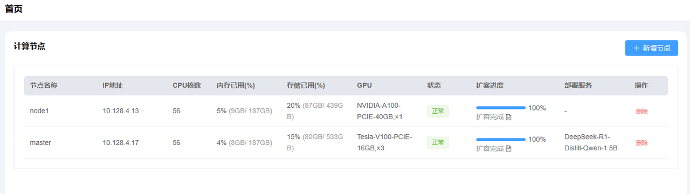

## 2.2 节点扩容

**Step 1: 新增节点**

1. 登录平台，点击 **"首页" > "新增节点"**。

2. 按照页面提示填写相关字段，将新节点加入平台。

登录平台后，点&#x51FB;**"首页-新增节点"**，按照页面提示填写字段，最终将新的节点扩容到平台中；

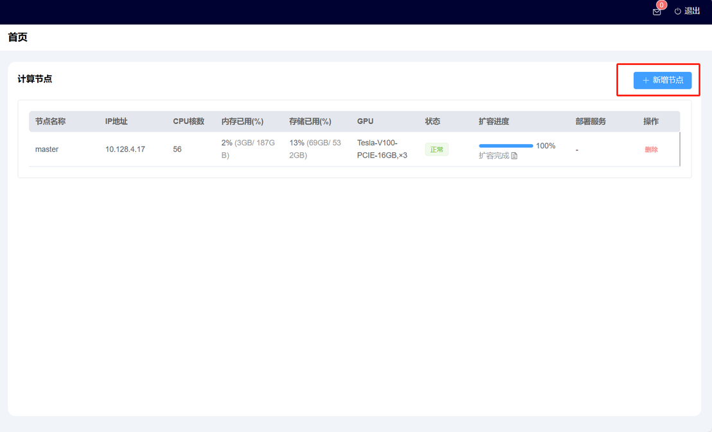

**Step 2: 填写节点信息**

1. 在弹窗中输入新节点信息：&#x20;

   * **节点名称**：不可重复。

   * **IP 地址**：请填写正确的 IP。

   * **Root 密码**：用于连接该节点。

   * **节点类型**：请根据实际资源情况选择。

2. 点击 **"确定"** 开始扩容，系统会自动执行扩容操作。

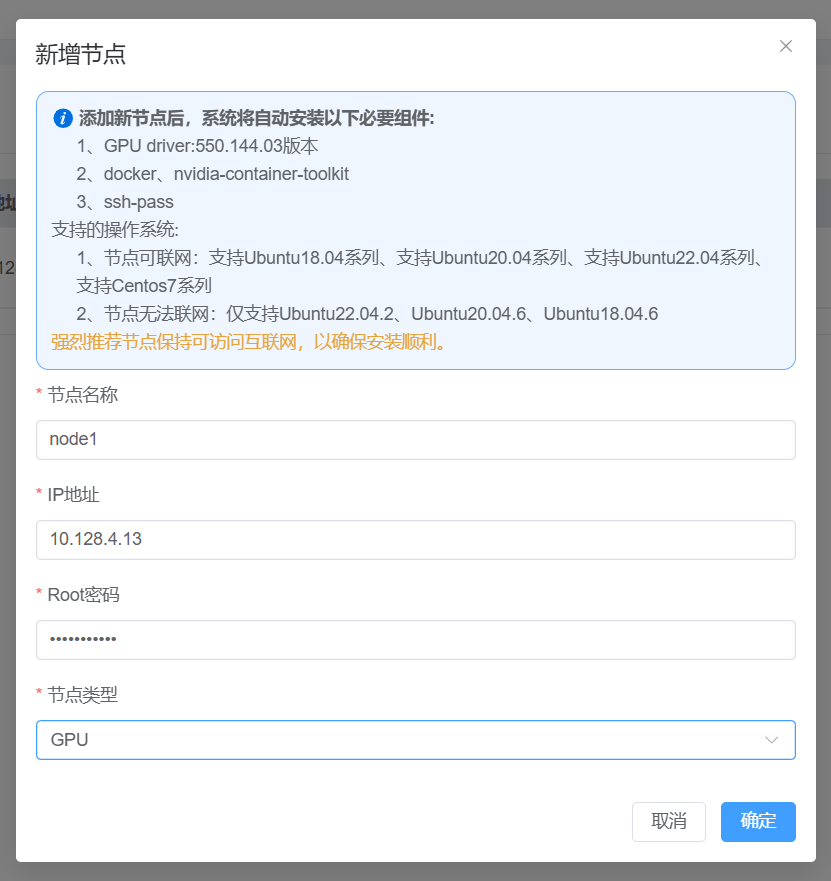

**Step 3: 监控扩容日志**

* 在扩容过程中，用户可以 **查看详细的日志**，跟踪进度。

* 如果遇到错误，建议检查 **网络连接、IP 配置、Root 账户权限**。

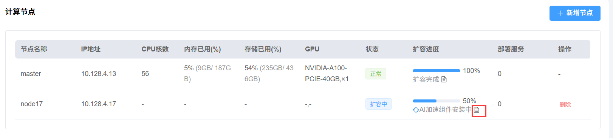

**Step 4: 扩容完成**

* 进度达到 **100%** 后，节点扩容成功。

* 新增的计算节点将出现在 **节点列表** 中，并可正常使用

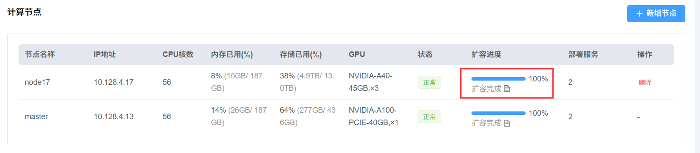

## 2.3 节点缩容

**移除节点**

1. 登录平台，点击 **"首页" > "节点列表" > "操作" > "删除"**。

2. 选择要删除的计算节点，确认删除。

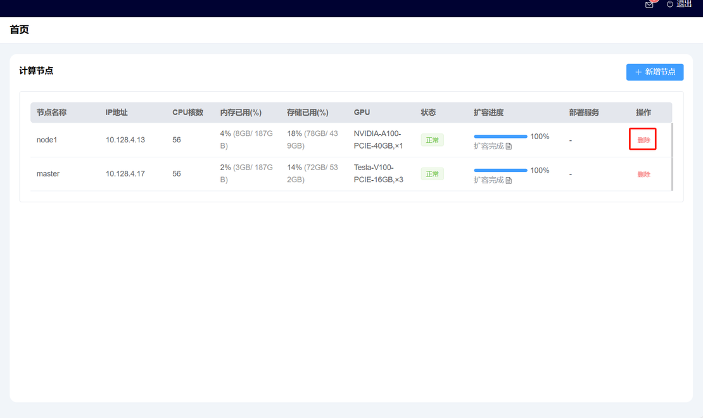

# 3. 服务部署

本章节介绍 **OpenStation** 平台的 **推理服务部署**，包括 **服务创建、实例管理、删除服务** 等功能，帮助用户实现 **OpenAI API 接口服务、多实例负载均衡、统一 API 访问**，并支持 **推理服务的扩缩容**。

## 3.1 部署服务

**Step 1: 进入服务部署**

1. 登录 **OpenStation** 平台，点击 **"模型服务" > "新增部署"**。

2. 按照页面引导，逐步完成服务部署。

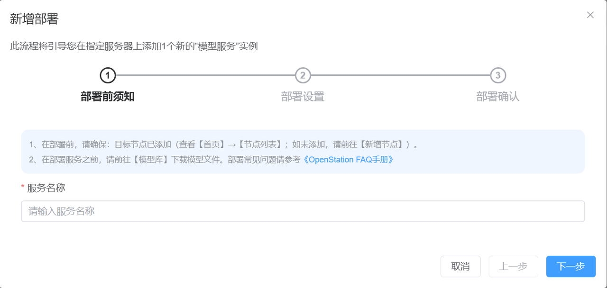

> **提示**：页面提供 **FAQ** 说明，解答 **超参数设置、分布式部署策略** 等常见问题。

**Step 2: 配置服务**

1. **选择模型来源**

* **从模型库选择**：已在 **"模型库"** 下载的模型，可直接选择。

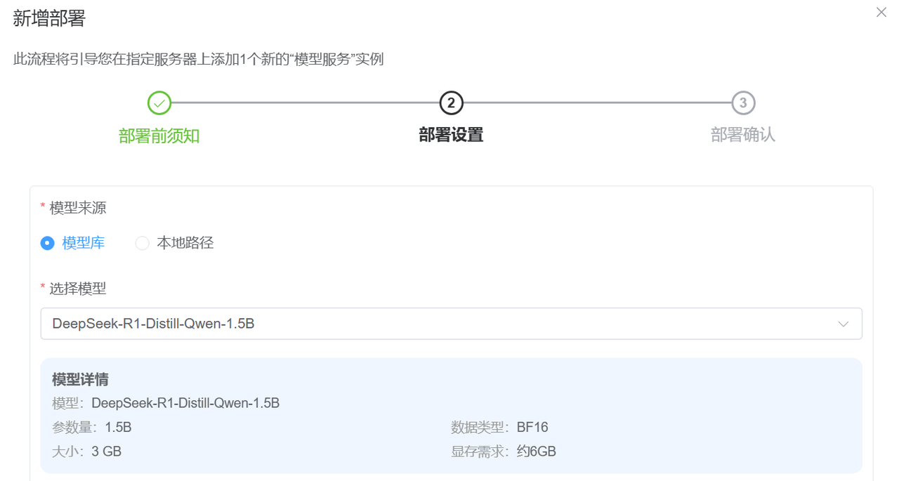

* **使用本地路径**：若模型文件已存在本地，可上传至 **OpenStation 部署节点**，并填写路径，例如：`/root/DeepSeek-R1-Distill-Qwen-1.5B/`

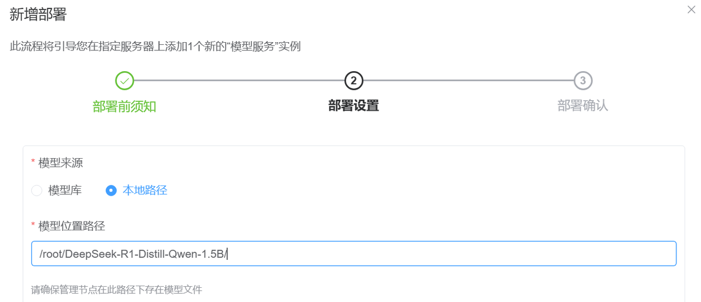

此时在节点上的模型文件如下所示：

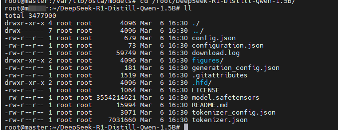

* **选择部署模式和部署节点**

- **Single**：单机部署模式，可选择 1 个GPU节点和至少一张加速卡，在该节点使用指定加速卡部署单个实例。平台推理引擎可选: SGLang(GPU)、vLLM(GPU)

- **Distributed**：分布式部署模式，选择多个节点（最少两个）的多张加速卡（每个节点选择的加速卡数量相同），平台会自动采用 **张量并行、流水线并行** 方式进行 **分布式部署**。平台推理引擎可选: vLLM(GPU)

- **CPU-Only**：纯CPU部署模式,可选择 1 个GPU/CPU节点，在该节点部署单个实例。平台推理引擎可选: vLLM(CPU-only)

> **提示**：选择希望部署的节点，平台会自动计算模型资源需求和节点资源的匹配关系、使用的推理引擎，当配置不当时会给出相应警告。

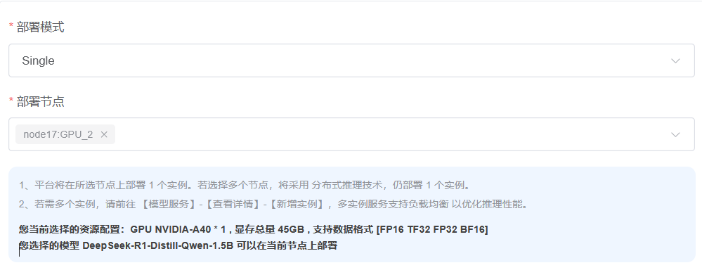

平台推理引擎的选择策略简述如下：

| 节点数   | 节点类型   | 使用的推理引擎                                                   |
| ----- | ------ | --------------------------------------------------------- |
| 1     | CPU    | 使用`vLLM(CPU-only)`推理引擎，仅使用CPU部署服务                         |
| 1     | GPU    | 使用`SGLang(GPU)`推理引擎，使用节点GPU部署服务                           |
| 2个及以上 | 仅支持GPU | 使用`vLLM(GPU)`推理引擎进行分布式部署，选择的第一个节点为头节点，通过张量并行和流水线并行进行分布式部署 |

**高级设置**：可自定义 **推理引擎** 或 **扩展参数**（如显存、并发控制），以优化推理服务的运行效果。

* **推理引擎选择**：

  * 可更改推荐推理引擎为 **自定义推理引擎**，但需确保 **推理引擎与计算资源匹配**。

  * 例如，可在 **GPU 节点使用 CPU 部署**，或 **用 vLLM 替代 SGLang 部署服务**。

* **推理引擎启动时的扩展参数设置(可选)**：

  * 可配置 **推理引擎启动参数**，传递 **自定义参数**，如：

  ```bash
  --a avalue --b bvalue
  ```

  * 该参数可用于 **设置显存管理、并发控制、模型数值格式** 等高级选项。

  * 详细参数说明请参考 **"部署前须知"** 的在线手册。

**Step 3: 确认并提交**

进入 **"部署确认"** 页面，检查所有配置后，点击 **"提交"** 进行部署。

* 部署后，可在 **"模型服务"** 页面查看 **服务名称、实例数、Model ID、API 访问地址、进度及日志**。

* 点击日志图标，可查看 **部署进度和错误信息**。

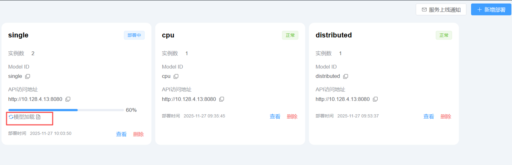

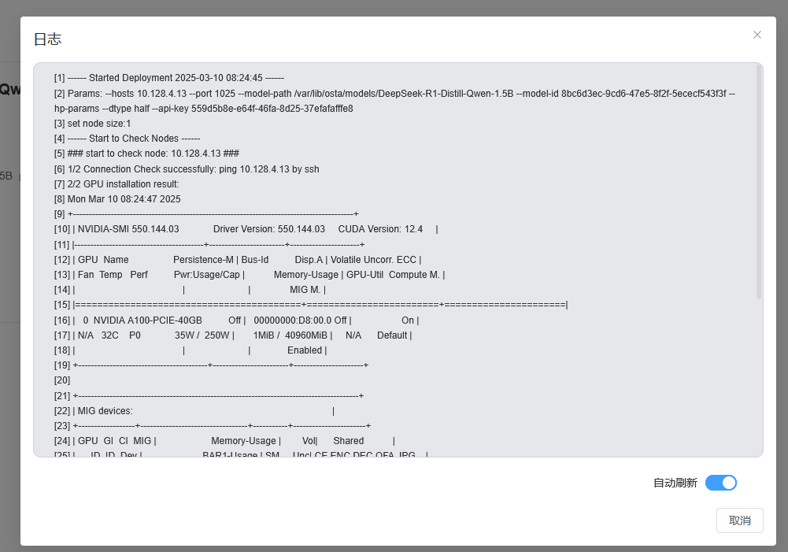

服务正常后，即可发起“**服务上线通知**”或使用页面提示的相关信息使用模型服务。

## 3.2 服务详情

点击 **"查看"** 进入服务详情页面，可查看：

* **服务状态**

* **API 访问地址**

* **实例详情**（ID、节点、资源使用率、状态）

* **调用日志**

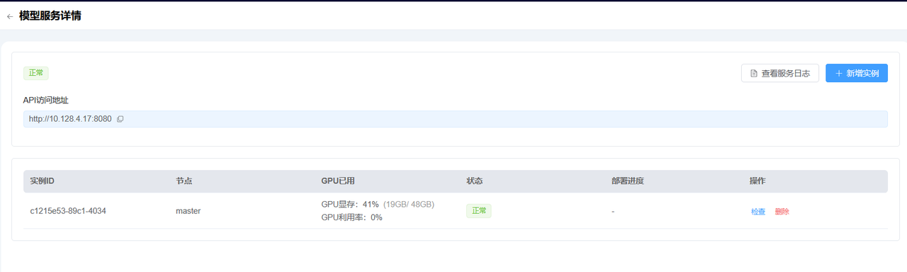

> **查看服务日志**：能够显示该推理服务收到的API调用和指标，按照时间倒序展示。日志信息包括请求时间、用户、模型名称、请求时长、请求token总数、tokens/s（TPS）和首token时延（TTFT）。

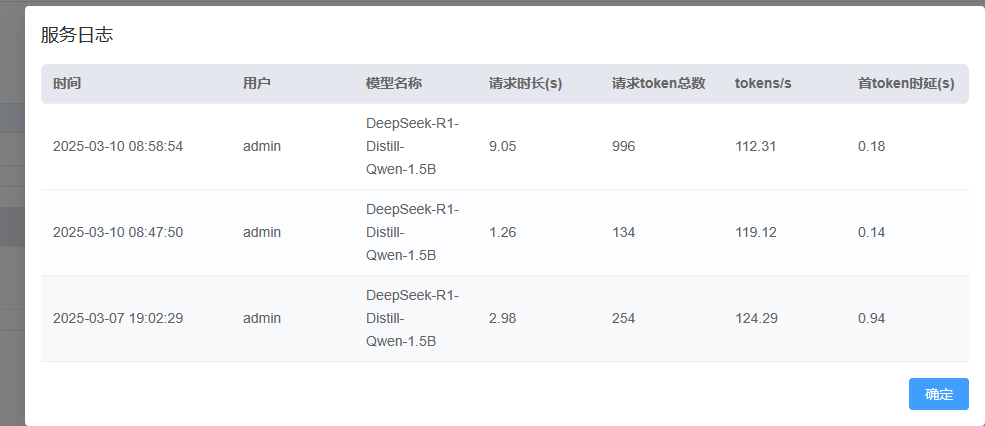

> **服务实例检查：**&#x5728; 实例列表 中点击 "检查" 按钮，即可触发实例的 健康状态检测。如果实例运行异常，系统将提示 检查失败。常见故障原因包括 网络连接异常、硬件故障 或 推理引擎与模型不兼容。


## 3.3 新增实例

当推理请求量增加时，可通过 **"新增实例"** 扩展服务：

1. 进入 **"模型服务详情"**，点击 **"新增实例"**。

2. 选择 **部署节点**，提交后查看 **实例部署状态及日志**。

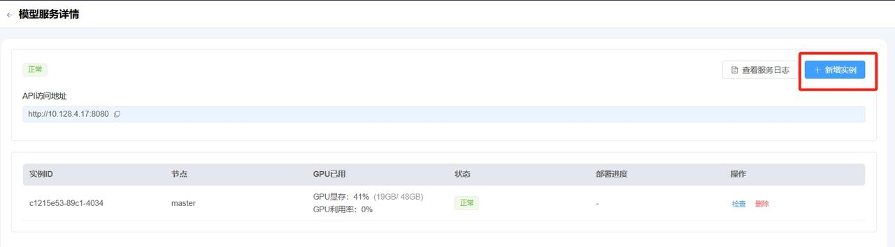

在弹出的窗口页面，选择对应的“**部署节点**”后，点击“**提交**”即可。

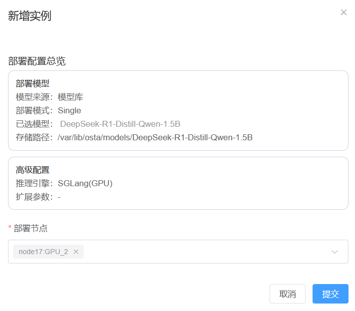

提交后，您可以实时查看 **实例部署状态** 及 **部署日志**。在新增实例的过程中，**现有服务的访问不会受到影响**。部署完成后，**新实例将自动加入服务池**，并由平台的 **负载均衡策略** 自动分配请求，实现流量均衡。

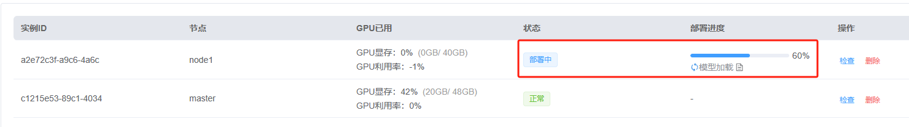

## 3.4 删除实例

在 **“模型服务详情”** 页面，点击 **实例列表** 中的 **“删除”** 按钮，可移除指定实例。删除过程中和删除后，服务的访问不受影响。

> **注意**：若删除 **最后一个正常运行的实例**，该推理服务将 **无法继续提供服务**。

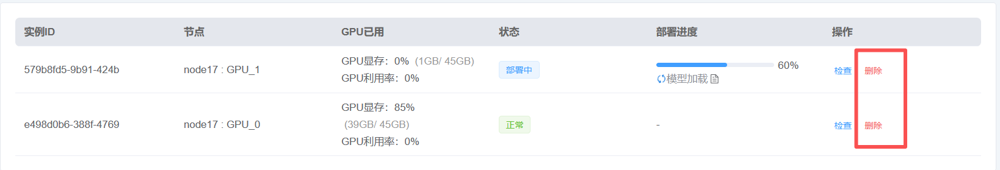

## 3.5 删除服务

在 **"模型服务"** 页面点击 **"删除"**，可删除整个服务，删除后：

* **API 请求将会失败**

* **所有实例自动释放**

* **服务不可恢复**

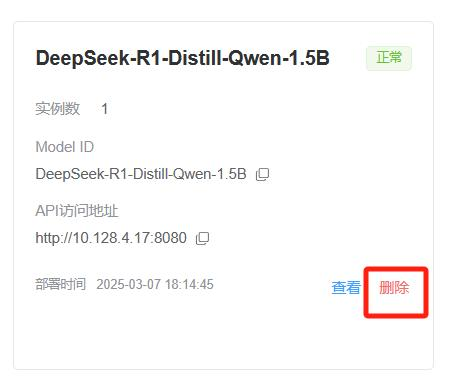

## 3.6 服务上线通知

服务部署完成后，可通过 **"服务上线通知"**：

* **发送邮件通知用户**

* **附带 API 使用指南**

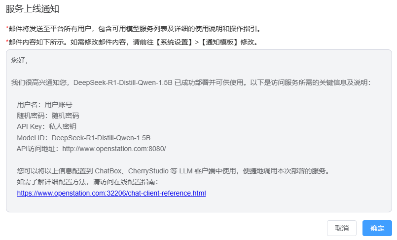

邮件内容示例如下：


# 4. 模型库

**模型库** 提供 **模型下载与管理** 功能，支持用户下载并管理不同的模型。下载完成后，用户可基于下载的模型 **创建模型服务**。

模型库支持以下功能：

* **模型下载**：从官方存储库（ModelScope）下载模型至平台。

* **下载管理**：支持 **下载暂停/恢复、断点续传**，并提供 **下载日志** 供用户查询。

* **模型删除**：支持删除已下载的模型，释放存储空间。

## 4.1 模型下载

**Step 1: 选择模型**

在模型库中选择 **待下载的模型**，系统将弹出提示，显示：

* **模型信息**（如模型名称、参数量）。

* **所需存储空间**（请确保设备有足够存储）。

> **提示**：建议连接 **稳定的网络** 以避免下载中断。


**Step 2: 下载进度监控**

开始下载后，页面将显示：

* **下载进度**（百分比）

* **下载速度**（实时更新）

可随时点击 **"下载日志"** 按钮，查看详细的下载信息。

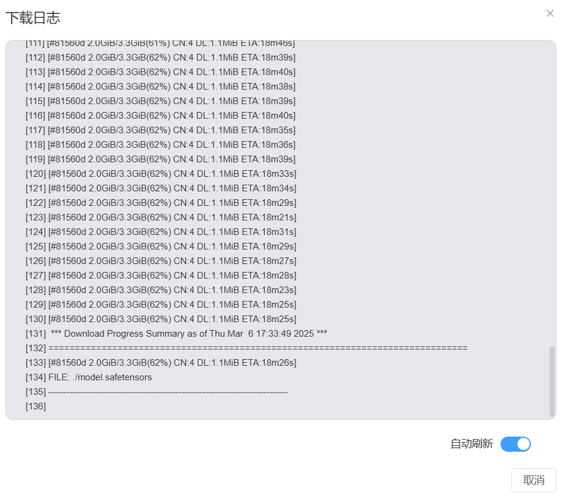

## 4.2 **下载管理**

* **多个下载任务排队**

  * 支持用户 **提交多个模型下载任务，按照提交顺序展示在下载列表中**，同时只能有一个模型在下载。
  
  * 当前下载的模型完成，**自动触发下一个排队的模型任务下载**。

* **暂停与继续下载**

  * 用户可随时在下载列表中 **暂停或继续下载**，暂停后自动触发下一个排队的模型任务下载。
  
  * 当前下载的模型暂停后，进度将 **保留**，并显示**暂停下载**，点击 **"开始"** 按钮，放入队列，并插队至正在下载的模型后面，显示**排队中**。
  
  * 存在多个暂停任务时，后开始的模型下载任务将插队至排队队列的最前面。

* **取消下载**

  * 取消后，**下载任务将被终止**，**进度与日志将清空**，取消后自动触发下一个排队的模型任务下载。

  * 若下载失败，用户可重新下载，系统支持 **断点续传**，无需重新开始。

## 4.3 **模型管理**

* **查看已下载模型**

  * **下载完成后**，模型的 **参数标签** 颜色将变为 **绿色**。

  * 点击 **绿色标签**，可查看 **已下载模型的详情**。

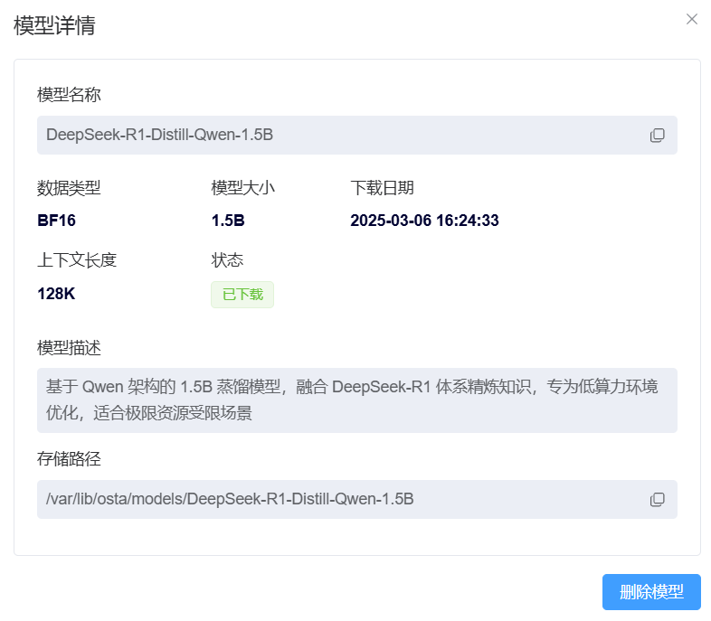

* **删除模型**

  * 在 **模型详情** 页面，点击 **"删除模型"** 按钮。

  * **模型文件将被彻底删除，且无法恢复**。

  * **删除后**，绿色参数标签会 **恢复为灰色**，表示该模型已被移除。

# 5. 用户管理

**用户管理** 提供对平台用户的全面管理，包括 **创建用户、批量导入、删除用户、重置密码、服务通知、禁用/启用** 等功能，确保用户权限可控、管理便捷。

## 5.1 创建用户

管理员可通过 **“用户管理” > “创建用户”** 添加新用户。

**Step 1: 填写用户信息**

* **用户名**

* **邮箱地址**

* **服务通知**（可选）：开启后，系统会自动向新用户发送 **模型服务访问指南** 邮件，邮件包含：&#x20;

  * **随机生成的登录密码**

  * **API Key**

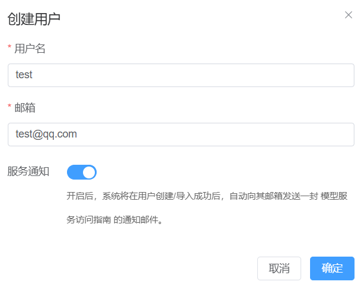

**Step 2: 同步至 Open-WebUI**（如适用）

如果 **已配置 Open-WebUI 并开启用户同步**，创建的用户将自动同步至 Open-WebUI。

## 5.2 批量导入用户

管理员可通过 **Excel 模板** 批量导入用户，简化大规模用户管理流程。

**Step 1: 下载 Excel 模板**

* 在 **"用户管理"** 页面，下载 **批量导入模板**。

* 填写 **用户名** 和 **邮箱** 信息。

**Step 2: 批量导入**

* 上传 **已填写的 Excel 文件**，系统将批量创建用户。

* **服务通知**（可选）：开启后，系统会向所有导入的用户发送 **模型服务访问指南** 邮件，邮件包含：&#x20;

  * **随机生成的密码**

  * **API Key**

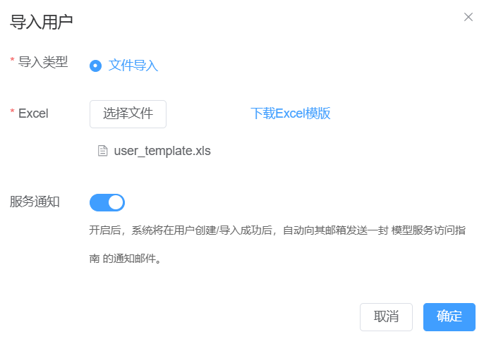

**Step 3: 同步至 Open-WebUI**（如适用）

如果 **已配置 Open-WebUI 并开启用户同步**，批量导入的用户将自动同步至 Open-WebUI。

## 5.3 删除用户

管理员可通过 **用户管理** 页面 **删除单个用户或批量删除**，删除后用户将无法访问平台。

**Step 1: 选择要删除的用户**

* 进入 **用户管理** 页面

* 选中一个或多个用户

* 点击 **“删除”**

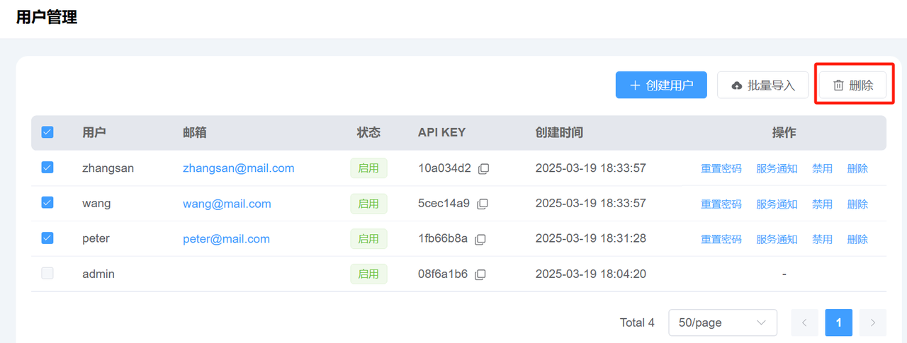

**Step 2: 同步至 Open-WebUI**（如适用）

如果 **已配置 Open-WebUI 并开启用户同步**，删除的用户也会自动从 Open-WebUI 中移除。

## 5.4 重置密码

管理员可为用户 **重置密码**，新密码将自动生成并可选择发送至用户邮箱。

**Step 1: 选择用户**

* 进入 **"用户管理"** 页面

* 选中目标用户

* 点击 **"重置密码"**

**Step 2: 发送新密码通知**（可选）

点击 **服务通知**，系统会向用户邮箱发送新密码及 **API Key**。

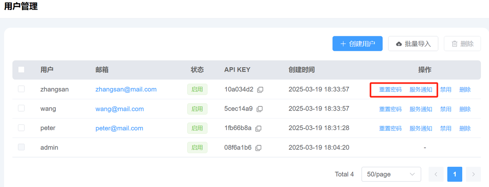

## 5.5 服务通知

**服务通知** 允许管理员向用户发送 **模型服务访问指南** 邮件，其中包含：

* **账户随机密码**

* **API Key**

* **平台访问指南**

**Step 1: 选择用户**

* 进入 **"用户管理"** 页面

* 选中目标用户

* 点击 **"发送服务通知"**

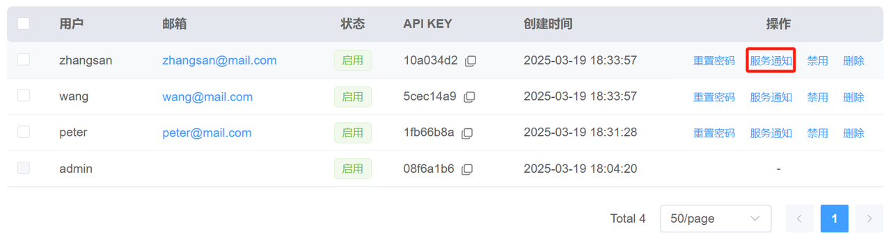

## 5.6 禁用/启用

**默认情况下，用户处于“启用”状态**，管理员可 **禁用或启用用户**。

**禁用用户**

* 禁用后，用户将 **无法登录 Open-WebUI**。

* 用户 API Key 可能无法访问相关服务。

**启用用户**

* 重新启用后，用户可恢复正常登录。

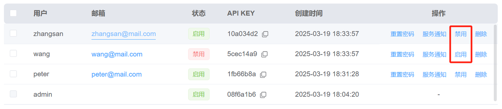

# 6. 系统设置

**系统设置** 模块提供 **邮箱配置、通知模板、域名配置、安全设置** 等功能，确保平台的基础配置可控，提升系统安全性和可维护性。

## 6.1 邮箱配置

管理员可在 **"系统设置" > "邮箱配置"** 页面配置邮件服务，**用于发送系统通知、账户信息、API Key 等邮件**。

**Step 1: 进入邮箱配置**

1. 登录平台

2. 点击 **"系统设置" > "邮箱配置"**

3. 进入配置页面

**Step 2: 选择邮箱服务**

* **支持 SMTP 方式配置**，需填写：&#x20;

  * **SMTP 服务器地址**

  * **SMTP 端口**

  * **发件邮箱账号**

  * **邮箱授权码**

* **快速配置选项**：平台提供 **163 邮箱、QQ 邮箱** 的便捷配置方案，简化操作。

**Step 3: 测试 & 保存**

* 填写邮箱配置后，可 **发送测试邮件** 进行验证。

* 确认无误后，点击 **"保存配置"** 使设置生效。

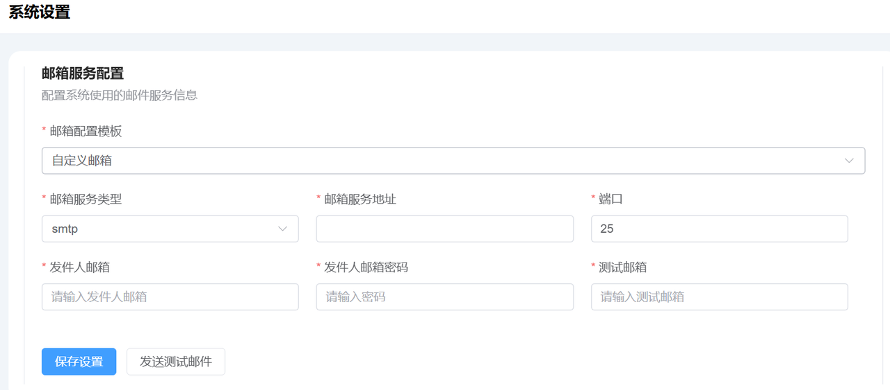

## 6.2 通知模板

**通知模板** 用于 **配置服务上线通知、账户创建通知等邮件内容**。管理员可在 **"系统设置" > "通知模板"** 页面进行管理。

**Step 1: 进入通知模板配置**

1. 登录平台

2. 点击 **"系统设置" > "通知模板"**

3. 进入配置页面

**Step 2: 配置邮件模板**

* **模板内容**：支持 **自定义邮件标题、正文**，可插入 **变量**（如ServiceName、API-Key、API-Endpoint-URL）。

* 确认无误后，点击 **"保存配置"** 使模板生效。

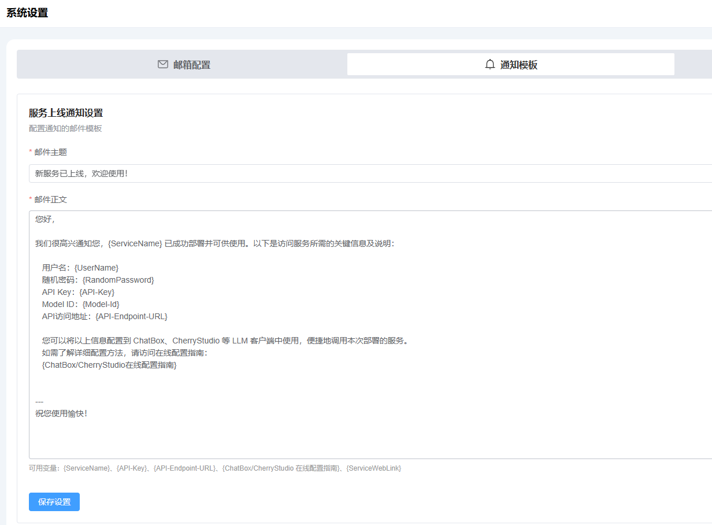

## 6.3 域名配置

登录平台后，点击“**系统设置-域名配置”**，打开配置页面，完成域名配置。

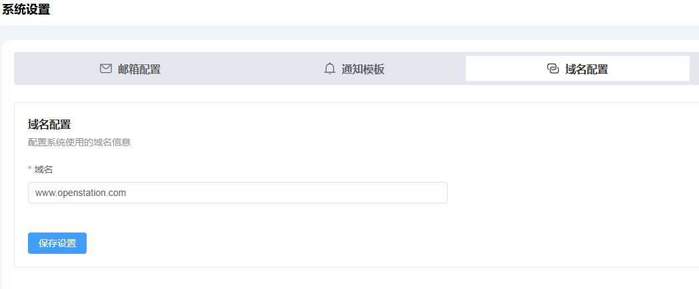

## 6.4 安全设置

**安全设置** 允许管理员 **修改管理员密码**，提高账户安全性。

**Step 1: 进入安全设置**

1. 登录平台

2. 点击 **"系统设置" > "安全设置"**

3. 进入配置页面

**Step 2: 修改管理员密码**

1. 输入 **当前密码** 进行身份验证。

2. 输入 **新密码** 并 **再次确认**（确保两次输入一致）。

3. 点击 **"保存设置"**，修改成功后 **自动退出登录**，需使用新密码重新登录。

**密码规则**（确保符合以下要求）：

* **最少 8 位**

* **至少包含 1 位数字**

* **至少包含 1 个小写字母**

* **至少包含 1 个特殊字符（`!@#$%^&*?`）**


# 7. WebUI集成与使用

**WebUI 集成** 允许管理员将 **Open-WebUI** 连接到平台，以便更直观地 **管理用户** 和 **访问推理服务**。**平台用户信息可自动同步至 Open-WebUI，但 Open-WebUI 变更不会影响平台用户**。

## 7.1 **WebUI 配置**

**默认情况下，WebUI 处于未配置状态**，管理员需手动完成配置。

**Step 1: 进入 WebUI 配置页面**

1. **登录平台**

2. 点击 **“WebUI 集成” > “配置”**

> **初始状态：未配置**，页面提示管理员进行 **WebUI 配置**。


**Step 2: 填写 WebUI 访问信息**

点击 **“配置”** 按钮，输入 WebUI 相关参数：

* **访问地址**：填写 Open-WebUI 的访问地址。

* **管理员邮箱**：输入 **WebUI 管理员邮箱**（用于管理用户）。

* **管理员密码**：输入 **WebUI 管理员密码**。

* **用户同步**（可选）：保持 **用户同步** 按钮 **开启**，平台用户将自动同步至 Open-WebUI。

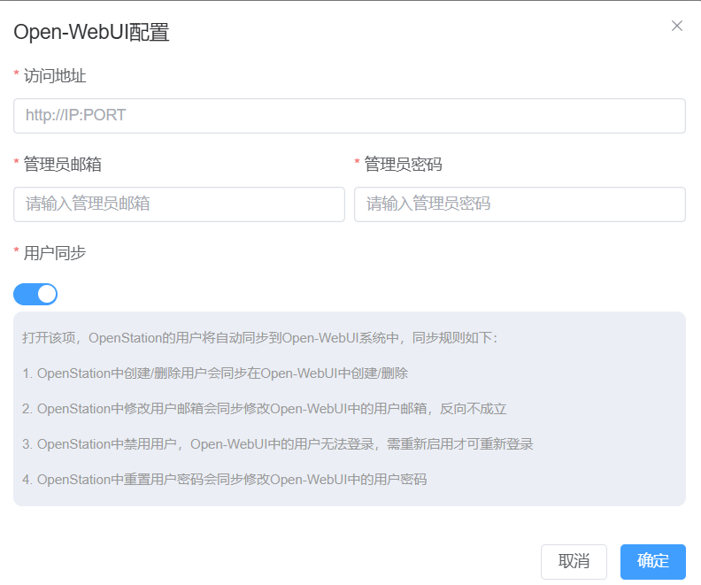

**Step 3: 完成配置**

配置完成后，页面将显示：

* **WebUI 连接状态**

* **用户同步状态**

* **WebUI 访问地址**

> **注意**：管理员可前往 **“用户管理”** 页面进行 **用户新增、导入、删除、禁用** 等操作，**所有变更将自动同步至 Open-WebUI**。但 **反向同步不成立**，即 **Open-WebUI 的用户变更不会影响平台用户**。


#

