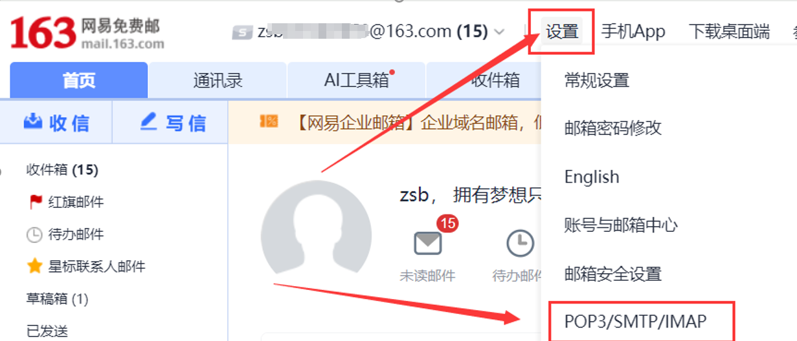
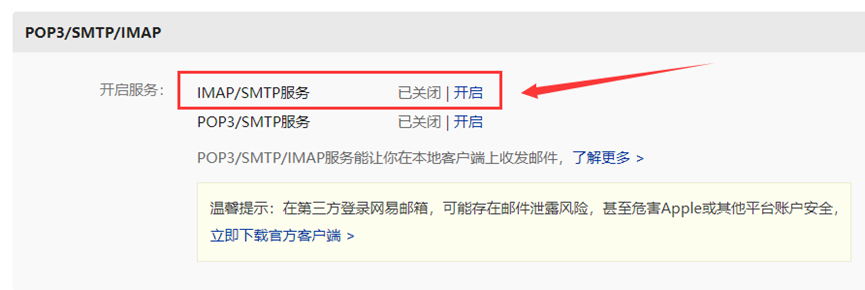
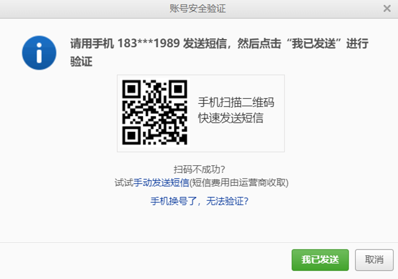
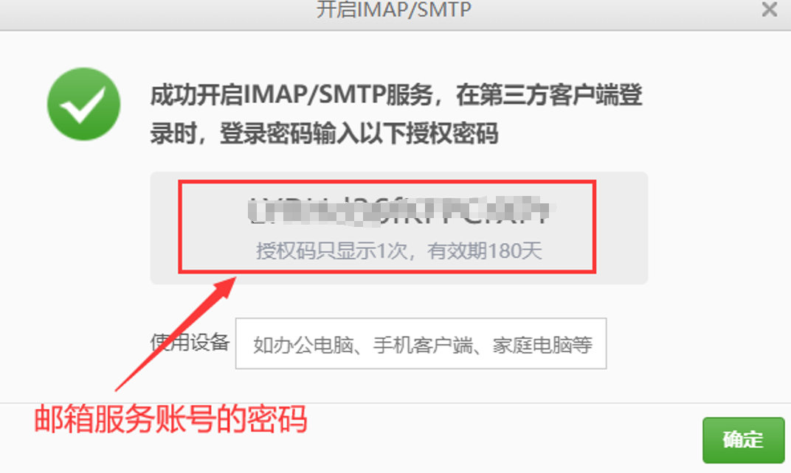
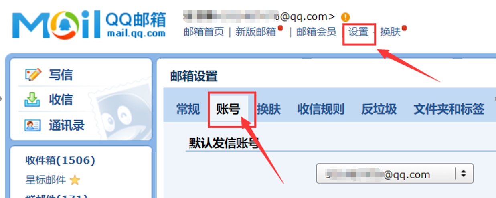
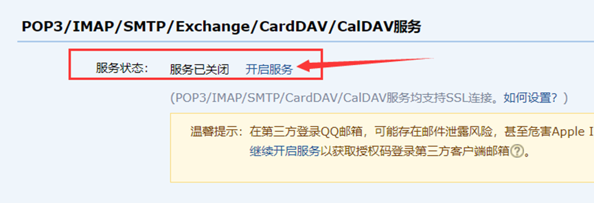
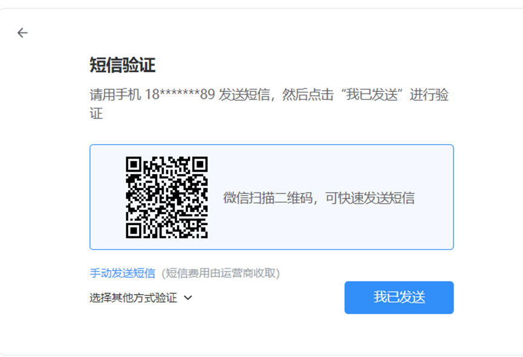
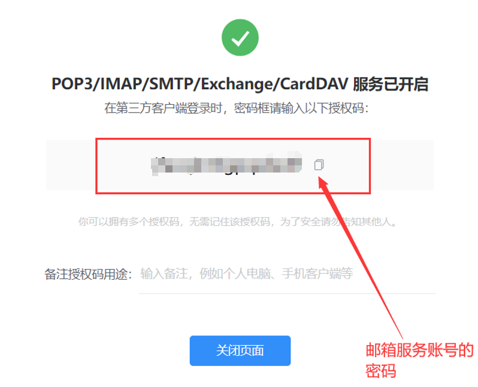
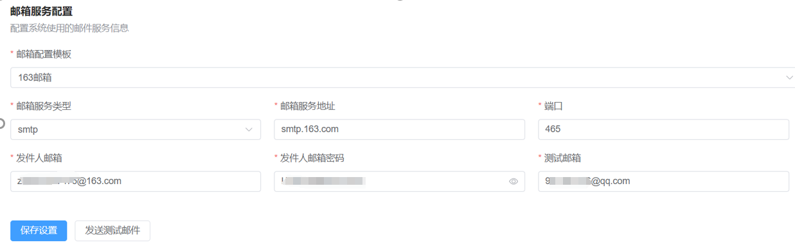
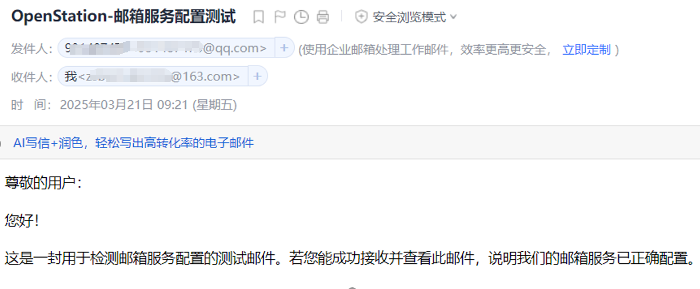

本文档旨在指导用户完成 OpenStation 平台中发件邮箱的配置操作，以便平台能够通过已配置的邮箱发送通知邮件。当前支持主流邮箱服务商，例如网易 163 邮箱和腾讯 QQ 邮箱，也支持企业自有邮箱配置。

***

## 一、网易 163 邮箱配置指南

1. 登录邮箱并进入设置界面

请使用浏览器访问 [163邮箱官网](https://mail.163.com/)，使用您的邮箱账号和密码登录系统。登录成功后，在页面右上角点击“设置”图标，进入邮箱设置页面。

* 启用 SMTP 服务

在设置页面中，选择“POP3/SMTP/IMAP”选项卡，找到“IMAP/SMTP服务”部分。点击“开启”按钮以启用该服务。

系统将提示您进行短信验证。请确保您的账号已绑定手机号，并按照提示完成短信验证。

验证成功后，页面将显示“服务已开启”字样，并弹出一组“客户端授权密码”。请妥善保存该授权码，它将在后续配置 OpenStation 发件邮箱时使用。

***

## 二、腾讯 QQ 邮箱配置指南

* 登录邮箱并进入设置界面

访问 [QQ邮箱官网](https://mail.qq.com/)，使用您的 QQ 账号和密码登录。登录后点击页面右上角的“设置”按钮，选择“账户”。

* 启用 SMTP 服务

在账户设置页面中，向下滚动至“POP3/IMAP/SMTP/Exchange/CardDAV/CalDAV服务”一栏，找到“服务状态，点击“开启服务”按钮。

系统将提示进行短信验证。请根据指引完成手机验证流程。

验证通过后，页面将显示“服务已开启”，并生成一个“授权码”。该码用于在 OpenStation 中配置发件邮箱时验证身份，请妥善保管。

***

## 三、在 OpenStation 中配置发件邮箱并发送测试邮件

完成邮箱服务端配置后，即可在 OpenStation 平台中进行发件邮箱设置。

* 配置发件邮箱信息

在 OpenStation 管理后台进入“系统设置 - 邮件配置”模块，填写以下信息：

* **发件人邮箱**：您的邮箱地址（如 <example@163.com> 或 <example@qq.com>）

* **SMTP服务器地址**：163邮箱通常为 smtp.163.com，QQ邮箱为 smtp.qq.com

* **端口号**：使用 465

* **邮箱授权码**：在邮箱服务开启时生成的授权码

填写完毕后，点击“保存配置”按钮。

* 发送测试邮件

在配置页面中点击“发送测试邮件”按钮，系统将自动向您指定的收件人发送一封测试邮件。

163邮箱可使用如下方式进行配置：

QQ 邮箱用户可使用如下方式进行配置：

收件人将会收到以下测试邮件，说明邮箱服务已可以正常使用：

***

## 四、常见问题与建议

* **未收到授权码**：请检查短信是否被手机系统拦截，或重新尝试开启服务；必要时重新绑定手机号。

* **发送测试邮件失败**：请检查 SMTP 地址、端口和授权码是否填写正确，确保网络未被防火墙阻止。

* **授权码失效**：部分邮箱服务商的授权码存在有效期限制，建议定期更新授权码。

***

本手册所涉及的界面截图与路径可能因邮箱服务商平台升级而略有差异，请以实际页面为准。

***

## 附录

如需更多帮助，请查看 [完整用户文档](../README.md)
